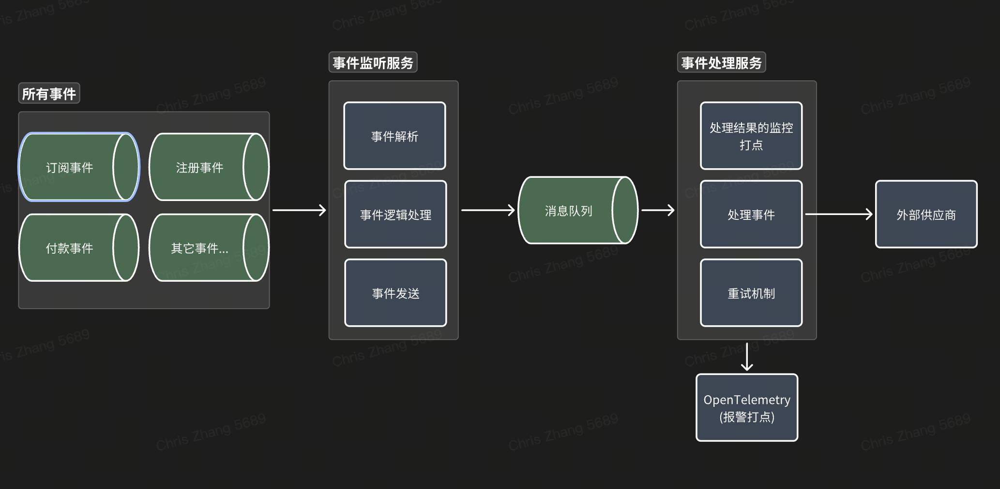

# 我对问题的理解
题目关键词：事件监听【涉及到MQ】，事件处理【不同的消息又有不同的处理逻辑】，做的是一个事件处理中台系统，针对这个系统，大致的职责如下：
- 监听业务中的各种事件
- 针对不同的事件类型，调用不同的外部系统供应商提供的 HTTP(S) API 进行通知
- 确保通知请求能够被稳定、可靠地送达
- 该系统本身只负责事件的监听和通知，不关注具体的业务结果，如果有需要，需要业务方自行配置【比如最终发送了请求，用户的request是否valid，需要业务方自行处理】
- 投递语义应该是至少一次：因为是HTTP请求，可能由于网络波动超时之类的原因，无法保证恰好一次，所以下游API应该保证**幂等**。

其实做的事情比较纯粹，针对单一事件而言，整条流程需要关注的事情大致如下：
- 事件的类型：是注册、购买、订阅付款成功等？
- 要发送给哪个消息队列？
- 请求的参数：请求的方法（POST/GET等），请求的Header/Body格式？

基于这个流程，可以实现一种配置化的方式，这样会很清晰，这里拿注册事件来做配置化举例：
```
{
    "event_type": "registration", // 事件类型，用于匹配配置
    "queue_name": "registration_queue", // 要发送给哪个消息队列？
    "http_method": "POST", // 请求的方法（POST/GET等）
    "http_url": "https://api.example.com/registration", // 外部供应商的URL
    "headers": {
        "Content-Type": "application/json" // 请求的Header/Body格式？
    },
    "body": {
        "event_type": "registration", // 请求的Body中包含的事件类型
        "user_id": "{$.event.user_id}" // 请求的Body中包含的用户ID，${event.user_id}会被替换为实际的用户ID
    }
}
```

# 整体架构和核心设计
中间件：
- 消息队列：用于接受各种关键事件发生的事件。所有的事件都被发布到这个队列中。【注册、购买、订阅付款成功等】
- 打点系统：OpenTelemetry，用于记录事件处理的指标和日志。

大致架构：


# 其他说明
如果这里不用消息队列，那么可能考虑将数据存储在MySQL/Redis中，然后消息处理服务定时轮训去MySQL或者Redis处理。这样也是OK的，但是像控制消费速率等功能就需要自己实现了。

题目有说到关于外部失败和长期不可用的场景，应该考虑怎么处理：
- 首先是要考虑重试机制：这里可以采用指数退避重试策略，即每次重试等待时间增加一倍，最多重试N次。
- 如果重试N次后仍然失败，那么可以将事件放入死信队列。同时针对死信队列量级也进行监控，后续进行持久化处理【如有必要】或者直接人工介入干预。
